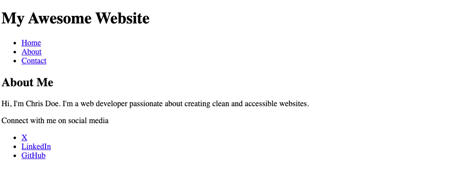

# Semantic HTML Elements Lab 1 - Try it Yourself

## Description 📄
In this Try It Yourself activity, you'll be code detectives! We'll start with some classic, non-semantic HTML. Then, we'll leverage the power of generative AI to see how it suggests making the code more meaningful.  By the end, you'll be able to identify generic elements, grasp the power of semantic HTML, and build your own well-structured web pages using elements like `<nav>`, `<main>`, and `<section>`. Get ready to code like a pro!

---

## Developer Objectives 📋

**Refactor generic elements:** Replacing generic elements with semantic ones.
**Using generative AI:** Use generative AI to refactor a codebase ethically and professionally.
**Embrace semantic elements:** Reading the response from generative AI on the reason for the use of semantic elements.

---

## Codespaces Guidance 📄
Should you need guidance on how to fork, open, edit, and maintain your codespaces, please use the link below by right clicking and opening in a new tab.  

[GitHub Codespaces Guidance](https://gist.github.com/JohnWP8253/4fff80f43d07a04ee3f1514c0a1d354a)

---

## ToDo list ✅
**Attention**: When you complete a task, put an `x` in the middle of the brackets to mark it off your ToDo list.

1. [ ] Choose which generative AI you would like to use. 
2. [ ] Write a prompt using your prompt engineering skills asking the AI to refactor the HTML into semantic HTML for you. 
3. [ ] Copy the HTML document and paste it in the generative AI after your prompt.
4. [ ] Watch the AI work.
5. [ ] Note the changes that AI made to your document. 
   1. What is different? 
   2. What stayed the same?
   3. Did the AI give any explanations?
6. [ ] Copy and paste the refactored code to your codespace and save it. You will use it in the next activity. 

---

🎊 **Fantastic work! You just used AI to refactor HTML to Semantic HTML! 💃🏻🕺🏾** 🎊

---

### Solution codebase 👀
🛑 **Only use this as a reference** 🛑

💾 **Not something to copy and paste** 💾

**Note:**  This lab references a solution file located [here](https://github.com/HackerUSA-CE/sdai-ic-d3-semantic-html-elements-1/tree/solution) (link not shown).
